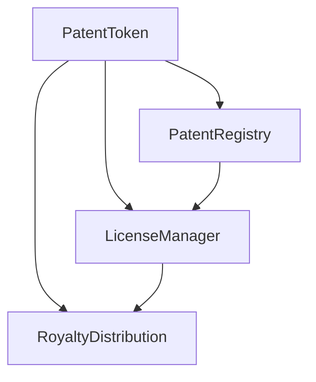

# PatentChain 🚀

A blockchain-based platform for patent tokenization, licensing, and royalty management. Transform intellectual property into verifiable digital assets on the Ethereum blockchain.


## 📖 Table of Contents

- [Overview](#overview)
- [Features](#features)
- [Architecture](#architecture)
- [Quick Start](#quick-start)
- [Smart Contracts](#smart-contracts)
- [Frontend](#frontend)
- [Testing](#testing)
- [Deployment](#deployment)
- [Usage Guide](#usage-guide)
- [Contributing](#contributing)
- [License](#license)

# 🎯 Overview

PatentChain revolutionizes intellectual property management by leveraging blockchain technology to create a transparent, secure, and efficient ecosystem for patent registration, licensing, and royalty distribution.

### Key Benefits
- **Immutable Proof**: Timestamped patent registration on blockchain
- **Fractional Ownership**: NFT-based patent tokenization
- **Automated Royalties**: Smart contract-powered revenue distribution
- **Global Licensing**: Decentralized license marketplace
- **Transparent History**: Complete audit trail of all transactions

# ✨ Features

### Core Functionality
- 🏷️ **Patent NFT Minting**: Convert patents into unique ERC-721 tokens
- 📋 **On-chain Registry**: Immutable patent verification and timestamping
- 🤝 **License Marketplace**: Create and trade patent licenses
- 💰 **Royalty Distribution**: Automated revenue sharing among stakeholders
- 🔐 **Access Control**: Granular permission management

### Advanced Capabilities
- 🎛️ **Multiple License Types**: Exclusive, non-exclusive, and field-specific licenses
- 📊 **Revenue Analytics**: Real-time royalty tracking and distribution history
- 🔄 **Time-based Access**: License duration management with automatic expiration
- 🌐 **IPFS Integration**: Support for decentralized patent metadata storage

# 🏗️ Architecture

### System Components
```
PatentChain/
├── 🏛️ Smart Contracts (Solidity)
│ ├── PatentToken.sol # ERC-721 NFT for patents
│ ├── PatentRegistry.sol # Patent verification & timestamping
│ ├── LicenseManager.sol # License agreement management
│ └── RoyaltyDistribution.sol # Automated revenue sharing
│
├── 🌐 Frontend (React + Vite)
│ ├── Patent Minter # Create patent NFTs
│ ├── Patent Gallery # Browse owned patents
│ ├── License Marketplace # Trade patent licenses
│ └── Royalty Dashboard # Manage revenue distribution
│
└── 🔧 Development Tools
├── Hardhat # Development framework
├── Ethers.js # Blockchain interactions
└── MetaMask Integration # Wallet connectivity
```

### Contract Relationships

# 🚀 Quick Start

### Prerequisites
```
Node.js 18+  
npm or pnpm 
MetaMask browser extension
```
### Installation & Setup
#### Clone the repository
```bash
git clone https://github.com/your-username/patentchain.git
cd patentchain
```
#### Install dependencies

Backend dependencies
```
npm install
```
Frontend dependencies
```
cd frontend
npm install
cd ..
```

### Start local development

```bash
# Terminal 1: Start local blockchain
npx hardhat node

# Terminal 2: Deploy contracts
npx hardhat run scripts/deploy_full.js --network localhost

# Terminal 3: Start frontend
cd frontend
npm run dev
Configure MetaMask


Network: Hardhat Localhost
RPC URL: http://127.0.0.1:8545
Chain ID: 31337
Import test accounts from Hardhat console output
```
# 📜 Smart Contracts
### PatentToken (ERC-721)

```solidity
// Key Functions
mintPatent()           // Create patent NFT
getPatentInfo()        // Retrieve patent metadata
setRevenueShares()     // Configure royalty distribution
royaltyInfo()          // EIP-2981 royalty standard
```
### PatentRegistry
```solidity
// Key Functions  
registerPatent()       // Register patent with hash verification
verifyPatent()         // Authenticate patent documents
updatePatentStatus()   // Manage patent lifecycle
```
### LicenseManager
```solidity
// Key Functions
createLicense()        // Create license agreement
purchaseLicense()      // Buy license rights
isLicenseValid()       // Check license status
```
### RoyaltyDistribution
```solidity
// Key Functions
setRevenueShares()     // Define revenue split
distributeRevenue()    // Execute payment distribution
getTotalReceived()     // Track earnings
```
# 🎨 Frontend

### Component Structure

```text
src/
├── components/
│   ├── Header.jsx           # Navigation & wallet connection
│   ├── PatentMinter.jsx     # Patent creation interface
│   ├── PatentList.jsx       # Patent gallery view
│   ├── LicenseMarket.jsx    # License trading platform
│   └── RoyaltyDashboard.jsx # Revenue management
├── hooks/
│   ├── useWeb3.js          # Wallet connection management
│   └── useContracts.js     # Contract interaction logic
└── utils/
    └── contracts.js        # Contract addresses & ABIs
```
### Key Features

Modern UI: Glassmorphism design with smooth animations   
Responsive: Mobile-first responsive design   
Real-time Updates: Live transaction status and balance updates   
Error Handling: User-friendly error messages and recovery  

# 🧪 Testing

### Run Test Suite

```bash
# Run all tests
npx hardhat test

# Run specific test file
npx hardhat test test/PatentChainFlow.js

# Run with gas reporting
npx hardhat test --gas

# Run with verbose output
npx hardhat test --verbose
```
### Test Coverage

✅ Contract deployment and initialization  
✅ Patent NFT minting and metadata  
✅ License creation and purchasing  
✅ Royalty distribution and tracking   
✅ Access control and permissions  
✅ Error conditions and edge cases  

# 🌐 Deployment   
### Local Development

```bash
npx hardhat node
npx hardhat run scripts/deploy_full.js --network localhost
Testnet Deployment (Sepolia)

bash
# Set environment variables
export SEPOLIA_URL=https://sepolia.infura.io/v3/YOUR_PROJECT_ID
export PRIVATE_KEY=your_wallet_private_key

# Deploy to Sepolia
npx hardhat run scripts/deploy.js --network sepolia
Production Deployment

bash
# Deploy to mainnet
npx hardhat run scripts/deploy.js --network mainnet

# Verify contracts on Etherscan
npx hardhat verify --network mainnet DEPLOYED_CONTRACT_ADDRESS
```

## 📖 Usage Guide
### 1. Patent Creation
```text
Connect your MetaMask wallet
Navigate to "Mint Patent" tab
Fill in patent details:

Patent number and title
Inventor information
Filing and grant dates
Royalty percentage (1-20%)
Detailed description
Confirm transaction in MetaMask
```
### 2. License Management
```text
Select "License Market" tab
Choose license type:

Exclusive: Single licensee
Non-exclusive: Multiple licensees
Field-specific: Restricted usage rights
Set license terms and pricing
Publish license for trading
```
### 3. Royalty Distribution
```
Access "Royalties" dashboard
Configure revenue sharing percentages
Distribute licensing revenue
Track payment history and earnings
```
# 🔧 Development

### Project Structure

```text
patentchain/
├── contracts/               # Solidity smart contracts
├── scripts/                 # Deployment scripts
├── test/                    # Test suites
├── frontend/                # React application
│   ├── src/
│   │   ├── components/      # React components
│   │   ├── hooks/           # Custom React hooks
│   │   └── utils/           # Utility functions
│   └── public/              # Static assets
└── hardhat.config.js        # Hardhat configuration
```
### Key Scripts

```bash
# Compile contracts
npx hardhat compile

# Clean build artifacts
npx hardhat clean

# Run Hardhat console
npx hardhat console --network localhost

# Generate coverage report
npx hardhat coverage
```
# 🤝 Contributing

We welcome contributions! Please see our Contributing Guide for details.

### Development Process

Fork the repository  
Create a feature branch (git checkout -b feature/amazing-feature)  
Commit your changes (git commit -m 'Add amazing feature')   
Push to the branch (git push origin feature/amazing-feature)  
Open a Pull Request   

### Code Standards
Follow Solidity style guide for smart contracts   
Use Prettier for code formatting   
Write comprehensive tests for new features   
Update documentation accordingly   

# 📄 License

This project is licensed under the MIT License - see the LICENSE file for details.

## 🛠️ Built With

Solidity - Smart contract language   
Hardhat - Ethereum development environment   
React - Frontend framework   
Ethers.js - Blockchain interactions    
Vite - Frontend build tool

## 🙏 Acknowledgments

OpenZeppelin for secure contract templates.   
Ethereum Foundation for blockchain infrastructure.   
Hardhat team for excellent development tools.   
React community for frontend ecosystem
<div align="center">
PatentChain - Revolutionizing Intellectual Property Management through Blockchain Technology

Report Bug · Request Feature

</div> 